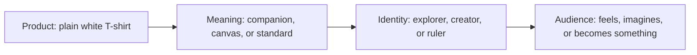

# Chapter 2: Brand Archetypes and Meaning

A plain product can mean many different things. A white T-shirt can suggest simplicity, independence, expertise, comfort, or creative possibility depending on how it is presented. **Brand archetypes** help explain and design those patterns of meaning.

An archetype is a generalized cultural and narrative pattern that people recognize. It gives a product, organization, or experience a familiar kind of role or promise. Archetypes are useful because they connect practical choices, such as words, images, materials, and behavior, to a larger question: **What does the audience get to feel, imagine, or become by choosing this brand?**

## Archetypes as a Branding Framework

An archetype is not a logo, color palette, slogan, or personality test. It is a lens for deciding what kind of meaning a brand repeatedly creates. A brand using the **Explorer** pattern might emphasize discovery and independence. A brand using the **Caregiver** pattern might emphasize support and protection.

The pattern should appear in more than advertising. It can shape the product experience, customer service, packaging, store or website, and the way the organization behaves. When these choices point in the same direction, an ordinary product can become recognizable as part of a particular story.

For example, the same white T-shirt could be presented as:

- an **Explorer** product for people who want a dependable layer for unfamiliar places;
- a **Creator** product for people who want a blank surface to alter and make their own; or
- a **Ruler** product for people who want precise construction and controlled simplicity.

The shirt has not changed. Its materials, fit, price, and limitations still matter. The archetype changes which meaning the brand makes most noticeable.

## Common Brand Archetypes

The following set is a practical vocabulary, not a universal law. Each archetype names a recurring emphasis and a possible audience outcome.

| Archetype | Central desire or promise | Audience may feel, imagine, or become |
| --- | --- | --- |
| Explorer | Freedom, discovery, and independence | Capable of finding a path beyond the familiar |
| Sage | Understanding, truth, and clarity | Better informed and able to judge for themselves |
| Creator | Imagination, expression, and making | Able to turn an idea into something personal |
| Ruler | Order, quality, and responsibility | In control, prepared, and confident in standards |
| Caregiver | Support, comfort, and protection | Looked after and able to care for others |
| Rebel | Resistance, change, and nonconformity | Free to challenge an accepted rule |
| Hero | Effort, courage, and achievement | Ready to overcome a difficult challenge |
| Everyperson | Belonging, equality, and approachability | Welcome, understood, and part of a community |
| Innocent | Simplicity, optimism, and trust | At ease and able to return to what feels uncomplicated |
| Jester | Play, humor, and spontaneity | More relaxed, amused, and willing to enjoy the moment |
| Lover | Connection, beauty, and sensory attention | More attractive, connected, or fully present |
| Magician | Transformation, possibility, and wonder | Able to imagine a meaningful change in themselves or their world |

These descriptions are starting points. A Sage can be warm or demanding. A Rebel can be playful or serious. An Everyperson brand can have high standards. The useful question is not which label sounds most flattering; it is which pattern best explains the experience the brand can honestly deliver.

## One Shirt, Several Meanings

Consider an identical plain white T-shirt with the same fabric, cut, and production details. Three different archetypal positions could make it feel like three different products.

### The Explorer shirt: a reliable companion

The Explorer version treats the shirt as a simple tool for movement. Its product page might show it packed into a small bag, worn in changing environments, or layered for an unplanned day. The language would emphasize adaptability, repairability, and freedom from overthinking what to wear.

The audience is invited to imagine becoming more ready for the next place. The shirt means dependable freedom, not luxury or rebellion. The brand must support that meaning with useful fit information, durable construction claims it can verify, and practical care guidance.

### The Creator shirt: a blank canvas

The Creator version treats the shirt as material for expression. Its presentation might show hand-painted marks, embroidery, patches, or different styling choices made by customers. The language would emphasize possibility and the value of making something distinct.

The audience is invited to imagine becoming an author of their own clothing. The shirt means potential. A Creator position could provide customization options, care instructions for adding designs, and space for people to show what they made.

### The Ruler shirt: disciplined simplicity

The Ruler version treats the shirt as an example of controlled quality. Its presentation might use precise measurements, a restrained layout, close views of seams, and clear information about construction and standards. The language would emphasize consistency, fit, and considered choice.

The audience is invited to imagine becoming someone whose environment reflects order and judgment. The shirt means authority through restraint. That promise would be weakened by vague sizing, inconsistent production, or visual clutter.

These positions are dramatically different even though the physical item is identical. One makes the shirt a companion, one makes it a material, and one makes it a standard. This is why branding is not simply adding decoration after a product is finished. It is organizing attention around a meaningful role.

## From Product to Audience Identity

An archetype works through a sequence. The product supplies something concrete, the brand interprets it, and the audience connects that interpretation to identity.

The sequence is not a guarantee that everyone will interpret the brand in exactly the same way. People bring their own experiences and cultural references. The diagram is a design tool for checking whether the intended product meaning leads to a believable audience outcome.

## Archetypes Are Not Destiny

Archetypes are models, not literal personality diagnoses. They do not tell us what a person truly is, and they should not be used to sort customers into permanent types. A person may choose an Explorer product on one day, a Caregiver product on another, and a Jester product with friends.

A brand may also contain multiple tendencies. A company can be a Sage in how it explains a complex service, a Caregiver in how it supports customers, and an Explorer in the opportunities it opens. The important task is to decide which pattern leads in a particular context and which patterns support it.

Cultural context matters too. Symbols of authority, independence, care, humor, beauty, or simplicity do not mean exactly the same thing everywhere. An image that suggests freedom to one audience might suggest irresponsibility to another. Archetypes should therefore be tested with the actual audience and revised when the interpretation does not match the intention.

Treating an archetype as destiny creates two problems. It can flatten real people into stereotypes, and it can make a brand perform a personality it cannot support. A useful archetype stays flexible enough for human complexity while remaining consistent enough to be recognizable.

## Making an Archetype Credible

An archetype becomes believable when the whole experience supports it.

- **Product:** Does the object or service actually deliver the promised role?
- **Language:** Do the words describe the audience's desired feeling or possibility clearly?
- **Visual choices:** Do images, layout, type, color, and materials reinforce the same meaning?
- **Behavior:** Do policies, support, and organizational actions match the promise?
- **Evidence:** Can the important claims be checked?

For the Explorer shirt, a dramatic mountain photograph would not be enough if the garment is fragile and the product information is unclear. For the Creator shirt, a colorful campaign would not be enough if customers have no way to customize or use the shirt as a creative starting point. The Ruler shirt needs more than a minimalist layout; its fit, construction, and service should be consistent too.

## Questions to Ask When Choosing an Archetype

- What does the audience get to feel, imagine, or become by choosing this brand?
- What concrete need or situation makes that meaning useful?
- Which archetype best describes the experience we can repeatedly deliver?
- What supporting archetypes are present, and which one should lead?
- How might different cultural groups interpret this symbol, story, or behavior?
- What evidence would show that the promise is real?
- Which product details, words, images, and actions would contradict the chosen archetype?
- Are we describing an audience possibility, or are we stereotyping the people in that audience?
- Can the same product support another meaningful position without hiding important facts?

These questions turn archetypes into a design and communication tool. They also keep the framework connected to truth. A brand should not promise transformation when it can only offer a visual suggestion, and it should not claim community while treating customers as interchangeable transactions.

## What You Should Remember

Brand archetypes are generalized cultural and narrative patterns that help products, organizations, and experiences carry recognizable meaning. They are not rigid human personality categories or permanent identities. A brand can combine several archetypes, and cultural context can change how a pattern is understood.

The plain white T-shirt shows the practical value of the framework: the same object can become a companion for exploration, a canvas for creation, or a standard of disciplined simplicity. Choose an archetype by asking what the audience gets to feel, imagine, or become, then support that promise through the entire experience.