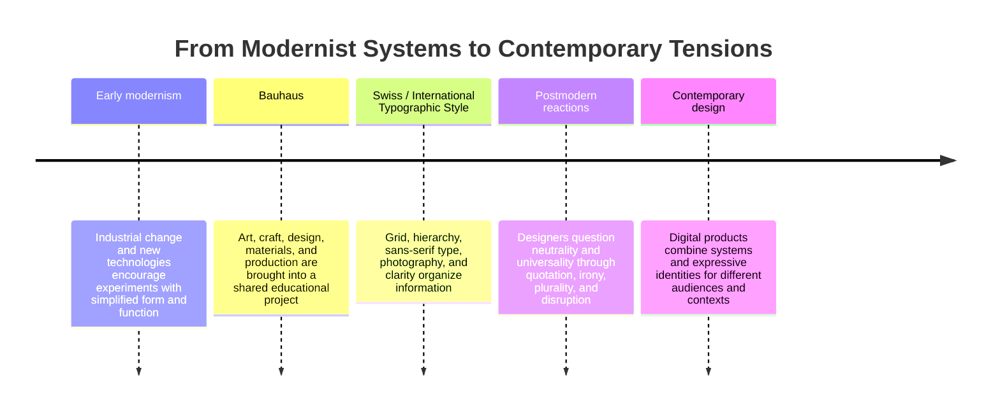

# Chapter 3: Modernism, Postmodernism, and Visual Language

Design does more than make information attractive. Choices about type, spacing, images, color, materials, and structure tell us what to notice and how to interpret it. A layout can feel calm, official, playful, rebellious, technical, or personal before we read every word.

This chapter introduces a historical argument about visual language. Modernist designers often searched for clarity, order, function, and forms that could work across cultural boundaries. Postmodern designers questioned whether one universal visual language was possible or desirable. Contemporary design continues to move between these positions.

## What Is Visual Language?

**Visual language is the set of visible choices that communicates meaning through form.** It includes typography, composition, color, scale, image style, materials, motion, and the relationships among them.

For example, a plain white T-shirt photographed against a blank background with a strict grid, precise measurements, and a neutral typeface may feel reliable and efficient. The same shirt photographed in a surprising crop with layered type, bright color, and a deliberately disrupted layout may feel expressive or ironic. The object is unchanged, but its visual language changes what the audience expects from it.

Visual language is not a secret code with one fixed translation. People interpret designs through culture, experience, context, and personal taste. A designer can guide interpretation, but cannot completely control it.

## A Short Path into Modernism

Early modernism developed alongside industrialization, new technologies, mass production, and changing social life. Designers increasingly asked how visual communication could be made more direct and useful for a modern world. Instead of relying only on historical ornament, they explored simplified forms, geometric structure, functional objects, and typography that could be reproduced efficiently.

The **Bauhaus**, founded in Germany in 1919, brought together art, craft, architecture, and design education. Its teachers and students did not all agree on one style, but the school is associated with experimentation, relationships between form and function, materials, workshops, and the possibilities of industrial production. The Bauhaus became an influential reference point for later design education and modernist practice.

The **Swiss Style**, also called the **International Typographic Style**, became especially influential in graphic design during the middle of the twentieth century. It commonly used a grid, sans-serif type, asymmetrical composition, clear hierarchy, photography, and restrained color. The aim was often to organize information so that it felt precise, legible, and independent of personal decoration.

Modernism was never just a look. It was also a belief that design could help create a more rational, accessible, and functional environment. That belief could be useful, but it could also become too confident about whose needs counted as universal.

## Postmodernism as a Reaction

Postmodern design developed partly as a reaction against modernist certainty, restraint, universality, and order. Designers questioned whether clean systems were truly neutral. They brought back quotation, historical references, ornament, irony, popular culture, expressive typography, unusual scale, and deliberate disruption.

Postmodernism is not simply the opposite of good design or a license to make things chaotic. It can make a design acknowledge its references, show a point of view, or challenge assumptions about authority and taste. Its plurality means that several styles or cultural references can appear together rather than being reduced to one universal system.

The contrast is useful because it makes design decisions easier to see. A strict grid communicates differently from an anti-grid composition. A restrained palette communicates differently from visual abundance. Neither choice is automatically correct; the appropriate choice depends on the audience, purpose, content, and cultural context.

## The Continuing Design Tensions

| Tension | One side emphasizes | The other side emphasizes | Question for a designer |
| --- | --- | --- | --- |
| Order and disruption | Stable relationships and predictability | Surprise, interruption, and challenge | Should the audience move smoothly or stop and reconsider? |
| Universality and identity | A shared system intended for broad use | Specific culture, voice, and lived experience | Whose experience is treated as the default? |
| Clarity and expression | Fast understanding and legibility | Personality, ambiguity, and feeling | Does the message need immediate reading or interpretation? |
| Grid and anti-grid | Alignment, rhythm, and structure | Layering, overlap, and irregular placement | Should relationships be visible or discovered? |
| Restraint and abundance | Limited elements and controlled emphasis | Many references, textures, colors, or signals | What amount of visual information suits the subject? |
| Function and irony | The form serves a clear practical purpose | The form comments on, questions, or playfully complicates its purpose | Should the design explain directly or make a point about explaining? |

These tensions are not a timeline in which one side permanently replaces the other. A public transit app may need a clear grid for schedules while using expressive illustrations to make the experience welcoming. A fashion site may use precise product details alongside an intentionally strange campaign image. Designers often combine approaches at different levels.

## A Timeline of Ideas

The timeline simplifies a complicated history. Movements overlap, contain disagreements, and develop differently across places. Use it as a map for asking questions, not as a list of styles that replaced one another perfectly.

## How Visual Language Works in Contemporary Design

Digital products make these tensions especially visible because they must organize information and create an identity at the same time.

- A finance dashboard may use a strong grid, restrained color, and clear hierarchy because people need to compare information quickly.
- A music or culture site may use oversized type, motion, collage, or overlapping layers to communicate energy and a distinct point of view.
- A civic service may combine a consistent design system with language and imagery that reflects the communities it serves.
- A product may use a quiet interface for everyday tasks and a more expressive campaign page for a launch or special event.

These choices have practical consequences. A disrupted layout can attract attention but make navigation harder. A universal system can improve consistency but may hide assumptions about language, disability, culture, or access. A highly expressive interface can communicate personality but may distract from an important task.

A thoughtful designer asks what the visual choice helps the audience do. The question is not merely, "Does this look modern?" It is, "What does this form make easier to understand, feel, question, or remember?"

## The Same White T-Shirt in Two Visual Languages

Imagine the identical plain white T-shirt presented in two ways.

### A modernist presentation

The shirt appears centered or carefully aligned in a clean grid. The page uses a restrained palette, a readable sans-serif typeface, consistent spacing, and precise information about measurements, fabric, care, and price. Every element has a clear role.

This presentation makes the shirt feel dependable, efficient, and considered. It invites the audience to value fit, function, and reduction. The design says that the product can be understood through organized information.

### A postmodern presentation

The same shirt appears in an unexpected crop, perhaps layered with oversized type, contrasting images, or references to different visual eras. The layout may interrupt its own order. The copy might draw attention to the fact that a basic garment can carry many cultural associations.

This presentation makes the shirt feel more self-aware, expressive, or playful. It invites the audience to question what counts as basic, fashionable, authentic, or original. The design says that meaning is constructed through references and context.

Neither presentation changes the shirt's fabric or fit. Both can be effective, but they make different promises. The modernist version foregrounds clarity and dependable use; the postmodern version foregrounds interpretation and cultural meaning.

## How to Read a Design

When looking at a poster, website, package, object, or interface, move from observation to interpretation:

1. **Describe what is visible.** Record the type, scale, color, image treatment, spacing, alignment, materials, and apparent order. Avoid judging it immediately.
2. **Notice hierarchy.** What do you see first, second, and last? What has been made prominent, and what has been made quiet?
3. **Identify the system.** Look for a grid, repeated spacing, consistent type styles, alignment, visual rhythm, or another organizing principle.
4. **Notice the interruptions.** Look for overlap, distortion, unusual scale, contrast, humor, quotation, or anything that breaks the expected system.
5. **Ask who is addressed.** What audience seems expected? What cultural references, language, bodies, abilities, or experiences are centered?
6. **Connect form to purpose.** What does the design help people do? What feeling or interpretation does it encourage?
7. **Test the tradeoff.** What becomes clearer because of the design? What becomes less clear, less visible, or less accessible?

This method keeps analysis grounded in evidence. Instead of saying only that a design feels modern or postmodern, point to the choices that create that impression.

## Museum Research

Museum and institutional collections are useful places to study authentic design objects, posters, type specimens, furniture, textiles, architecture, and digital-design history. Search the collection databases of institutions such as The Metropolitan Museum of Art, MoMA, Cooper Hewitt, the V&A, Bauhaus archives, or other credible museums and archives.

Use focused search terms such as:

- `Bauhaus typography`
- `Bauhaus furniture design`
- `Swiss International Typographic Style`
- `modernist poster grid`
- `postmodern graphic design typography`
- `design history visual identity`
- `geometric abstraction graphic design`

When researching, verify each object yourself. Check the institution's collection record, object title, creator, date, materials, and description. Do not assume that an image found in a search result belongs to a particular movement, designer, or institution. Record the actual collection page or catalog information you use, and distinguish the museum's description from your own interpretation.

A useful research note might include:

| Observation | Evidence to record | Interpretation to test |
| --- | --- | --- |
| Type is aligned to repeated vertical lines | Grid, typeface, date, and collection description | The system may prioritize order and legibility |
| Historical styles are mixed together | Visual references and object context | The design may use quotation or irony |
| A figure or community is represented prominently | Image details and institutional description | Identity may be part of the design's intended audience |

The goal is not to label an object quickly. It is to build an evidence-based explanation of how its visual language carries ideas.

## What You Should Remember

Visual design carries ideas through choices about form, structure, hierarchy, reference, and emphasis. Modernist traditions such as Bauhaus and Swiss / International Typographic Style made order, function, systems, and clarity highly visible. Postmodern reactions questioned universal rules and made room for plurality, identity, irony, quotation, and disruption.

These approaches remain in conversation. Contemporary web and product design may need a grid and a distinctive voice, clear information and cultural specificity, restraint and expressive abundance. The plain white T-shirt demonstrates the central lesson: the object can stay the same while its visual language changes what the audience expects it to mean. Read design by observing its choices, asking who they serve, and testing what they make clear or difficult to see.
