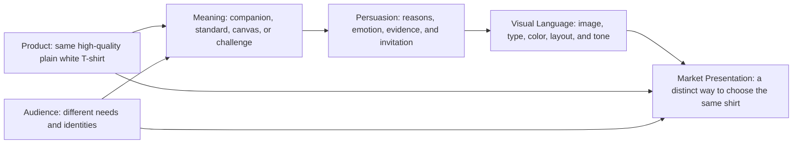

# Chapter 4: One White T-Shirt, Four Different Worlds

A plain white T-shirt looks like a small design problem. It has no elaborate print, no unusual silhouette, and no obvious story printed on its surface. That is exactly why it is useful. When the object stays nearly the same but the presentation changes dramatically, we can see how audience, archetype, persuasion, and visual language work together.

For this case study, imagine one product: a high-quality plain white T-shirt with a comfortable everyday fit, durable stitching, and clear care and sizing information. Those physical qualities remain substantially the same in every version. The shirt does not magically become more adventurous, more rebellious, or more luxurious. The presentation changes what people are invited to notice and what the shirt is allowed to mean.

## The Assignment: Sell the Meaning, Not a Different Shirt

Each concept below is a different market presentation of the same imaginary garment. A useful way to read them is to separate three layers:

1. **The object:** What the customer physically receives.
2. **The promise:** What the brand says the object helps the customer do or feel.
3. **The meaning:** What kind of person or life the customer is invited to imagine through the purchase.

The second and third layers can change a lot. They still have to remain connected to the first. A photograph can suggest a life of freedom, but it cannot honestly promise that a T-shirt will solve every problem of travel. A precise grid can suggest quality, but it cannot substitute for accurate measurements.

## Concept One: Field Notes

### Audience

People who want a dependable wardrobe for commuting, day trips, travel, and changing plans. They value usefulness and independence more than showing off a trend.

### Chosen brand archetype

**Explorer.** The shirt is presented as a reliable companion that leaves room for the wearer to choose the direction of the day.

### Persuasion principles being used

- **Framing:** The shirt is framed as adaptable equipment rather than a status object.
- **Authority:** Clear information about fit, fabric, care, and construction supports the practical claims.
- **Commitment and consistency:** A packing checklist or saved wardrobe plan helps customers connect the purchase to a voluntary goal of traveling lighter.
- **Liking:** The voice is capable and curious without pretending that every customer is an extreme adventurer.

### Visual-design language

Documentary photography, natural light, map-like lines, field-note captions, and a calm but earthy palette. The layouts leave useful space for details such as measurements and care instructions. The design feels prepared for movement without turning an ordinary errand into an expedition.

### Headline

**Leave room for the next turn.**

### Short product story

You pack the shirt for a train ride and wear it again after an unplanned stop. It layers easily, takes up a familiar place in the bag, and does not demand that the day revolve around it. Its job is to be ready without becoming the main event.

### Imagery direction

Show the shirt in believable transitional settings: folded beside a notebook and water bottle, worn under a light jacket, or drying after a wash in a small room. Include ordinary environments as well as unfamiliar ones. Avoid implying that the shirt itself creates courage or adventure.

### What meaning is the customer invited to buy?

The customer is invited to buy **freedom from unnecessary decisions**. The shirt becomes evidence that they are ready to go somewhere, even if the destination is only across town. The deeper purchase is an image of self-directed movement.

### Ethical concern or possible misuse

Adventure imagery can romanticize constant travel or make an ordinary customer feel inadequate for having a stable routine. The brand should not imply that buying the shirt makes someone brave, worldly, or environmentally responsible. It should also avoid unsupported durability and sustainability claims.

## Concept Two: The Measured Essential

### Audience

People building a small, organized wardrobe who want to compare fit, construction, price, and care requirements with minimal visual noise.

### Chosen brand archetype

**Ruler.** The shirt is positioned as a controlled standard: simple, consistent, and carefully specified.

### Persuasion principles being used

- **Logos:** Measurements, material details, garment dimensions, and care instructions give the audience reasons to compare.
- **Authority:** Construction details and transparent policies establish relevant credibility.
- **Social proof:** Verified reviews can address fit and comfort, including negative experiences rather than only praise.
- **Framing:** Restraint is framed as an intentional choice rather than a lack of imagination.

### Visual-design language

Restrained modernist and Swiss-influenced design: an asymmetric grid, sans-serif typography, precise alignment, generous white space, limited color, and documentary product photography. The shirt is shown front, back, and in close detail. Type hierarchy does most of the organizing work.

### Headline

**The standard you can see.**

### Short product story

Instead of asking the shopper to decode a mood, the product page answers practical questions. How does the shoulder sit? What are the measurements? How should it be washed? The shirt earns its place through repeatable information and a fit the customer can evaluate.

### Imagery direction

Use a neutral background, consistent lighting, a front-and-back view, detail shots of stitching, and a person shown in a range of ordinary poses. Pair every expressive image with concrete product information. The person should look like a real customer, not an unreachable symbol of perfection.

### What meaning is the customer invited to buy?

The customer is invited to buy **competence through simplicity**. The shirt means that they can make a considered choice and keep their surroundings intentional. It offers quiet control, not superiority.

### Ethical concern or possible misuse

The language of standards can become class-coded or judgmental. A brand might imply that people with larger, more colorful, less minimal wardrobes are careless or inferior. Precision also becomes misleading if the measurements are inconsistent, if important costs are hidden, or if a clean layout makes weak evidence look authoritative.

## Concept Three: Blank Is a Verb

### Audience

Students, artists, makers, club members, and anyone who treats clothing as a starting point for personal expression.

### Chosen brand archetype

**Creator.** The shirt is material: a surface that can be styled, altered, printed, embroidered, repaired, or left deliberately plain.

### Persuasion principles being used

- **Commitment and consistency:** Inviting people to sketch an idea or select a customization plan creates a voluntary connection to making.
- **Social proof:** Customer examples show many kinds of finished shirts without suggesting that one style is the correct one.
- **Liking:** The tone is generous and collaborative, making experimentation feel welcome.
- **Reciprocity:** A genuinely useful guide to preparing, decorating, and caring for the shirt gives value before purchase.

### Visual-design language

Workshop energy: process photographs, scanned marks, swatches, handwritten annotations, visible tape, and a lively but readable collage. The design celebrates unfinished states. It can be colorful and layered while keeping product information easy to find.

### Headline

**Blank is a verb.**

### Short product story

The shirt arrives as a beginning rather than a finished personality. One wearer leaves it white and changes the styling. Another adds a small embroidered mark. A student group turns several into a shared project. The object supports the making, but the maker supplies the meaning.

### Imagery direction

Show hands preparing materials, test marks, imperfect prototypes, repair details, and finished shirts made by different people. Include the plain shirt before transformation. Do not show a customization effect that the brand does not actually offer or explain how customers can achieve it.

### What meaning is the customer invited to buy?

The customer is invited to buy **authorship and possibility**. The shirt means, "I can make this mine," rather than, "This logo tells you who I am." The value is partly in the permission to begin.

### Ethical concern or possible misuse

The brand could turn creativity into another form of pressure, making people feel that a plain shirt is incomplete unless they personalize it. It should also address intellectual property and cultural respect when customers copy symbols or designs. Customer work should not be used in marketing without clear permission.

## Concept Four: Basic Is a Fight

### Audience

Young shoppers who are skeptical of polished lifestyle branding and enjoy humor, cultural references, visual contradiction, and products that comment on fashion itself.

### Chosen brand archetype

**Rebel.** The shirt challenges the assumption that a basic garment must be presented politely, quietly, or as a marker of effortless status.

### Persuasion principles being used

- **Contrast and framing:** The familiar shirt is placed in an unfamiliar frame so the audience reconsiders what "basic" means.
- **Liking:** Humor creates recognition with people who enjoy self-aware brand communication.
- **Unity:** The message can connect with a community that questions polished consumer signals, but it must not demand proof of membership.
- **Scarcity, only if real:** A limited run of a particular campaign print could be used, but the plain shirt itself should not be falsely labeled rare.

### Visual-design language

Disruptive and postmodern: clashing type scales, copied-and-reworked visual references, abrupt crops, stickers, ironic captions, bright blocks of color, and an anti-perfect composition. The layout may interrupt itself, but essential information remains accessible. The visual joke should not make the garment's price, fit, or availability impossible to understand.

### Headline

**A blank shirt with opinions.**

### Short product story

The campaign treats the supposedly neutral T-shirt as a stage for arguments about taste. One image calls it a uniform; another calls it a costume; a third simply shows someone wearing it while doing laundry. The shirt stays ordinary. The presentation asks why ordinary has to mean invisible.

### Imagery direction

Use unexpected pairings: the shirt beside formal objects, dramatic crops of ordinary scenes, intentionally awkward poses, and layered captions that disagree with one another. Let the campaign be playful without mocking bodies, identities, accents, or people who prefer a quieter style.

### What meaning is the customer invited to buy?

The customer is invited to buy **distance from marketing performance**. The shirt means that they can recognize the sales pitch, enjoy the joke, and still choose the product. Ironically, the anti-brand attitude becomes a brand attitude of its own.

### Ethical concern or possible misuse

Rebellion can become a costume sold to people with no meaningful choice about the systems being criticized. Irony can also hide weak product information or make harmful stereotypes seem acceptable because they are presented as jokes. The brand should state what it actually believes, give the same honest details as any other version, and avoid borrowing the language of protest without supporting the people or issue it references.

## What Changed When the Shirt Did Not?

The physical product remained substantially constant. The market presentation changed because each concept answered a different question:

- **Field Notes:** Where might this shirt take me?
- **The Measured Essential:** How can I judge whether this shirt is right for me?
- **Blank Is a Verb:** What could I make from this shirt?
- **Basic Is a Fight:** What assumptions about ordinary clothing can I question?

These are not merely four color palettes. Each one selects a different audience, archetype, emotional reward, evidence pattern, and visual system. That is why the presentations feel like different products even though the object is still a plain white T-shirt.

## Synthesis Table

| Concept | Audience | Archetype | Main meaning | Persuasion emphasis | Visual language | Main ethical risk |
| --- | --- | --- | --- | --- | --- | --- |
| Field Notes | Independent commuters, travelers, and flexible planners | Explorer | Freedom from unnecessary decisions | Framing, authority, commitment, liking | Documentary, map-like, practical | Romanticizing travel or overstating durability |
| The Measured Essential | Minimal wardrobe builders and careful comparers | Ruler | Competence through simplicity | Logos, authority, social proof, framing | Restrained modernist / Swiss-influenced grid | Turning minimalism into judgment or hiding weak evidence |
| Blank Is a Verb | Students, artists, makers, and groups | Creator | Authorship and possibility | Commitment, social proof, liking, reciprocity | Workshop collage and process marks | Pressuring customization or misusing customer designs |
| Basic Is a Fight | Skeptical, humor-oriented, anti-polish shoppers | Rebel | Distance from marketing performance | Contrast, framing, liking, unity, real scarcity | Disruptive postmodern collage | Empty rebellion, harmful irony, or obscured information |

## The Combination Model

The presentation is strongest when its parts point in the same direction. The product supplies real qualities; the audience supplies a situation and a desire; meaning gives the purchase a larger interpretation; persuasion makes the message believable; and visual language makes that interpretation noticeable.

The diagram is a design check, not a formula for controlling people. If the visual language says "careful standard" but the sizing information is vague, the parts contradict one another. If the message says "your own creative beginning" but the campaign shows only one approved style, the promise becomes narrower than it sounds. Alignment builds credibility; contradiction can reveal a misleading presentation.

## A Responsible Designer's Checklist

Before publishing one of these presentations, ask:

- What does the audience physically receive, and what is only symbolic?
- Which claims can the audience verify from the product page or packaging?
- What feeling or identity is the customer invited to imagine?
- Does the archetype describe a credible experience or stereotype the audience?
- Does the visual language help people understand the product, or only make it look exciting?
- Are scarcity, social proof, authority, and community real and accurately described?
- Could the message shame people who do not buy, cannot buy, or do not share the intended identity?
- Can a customer compare, ask questions, decline, and change their mind?

The goal is not to remove meaning from marketing. Meaning is one of the reasons people care about ordinary objects. The goal is to make the meaning legible and honest enough that customers can decide whether it belongs to them.

## What You Should Remember

One physical product can support radically different market presentations. The same white T-shirt can become an Explorer's companion, a Ruler's standard, a Creator's blank canvas, or a Rebel's argument about what counts as basic.

Audience, archetype, persuasion, and visual language change what people notice and what they imagine buying. They do not erase the shirt's actual fit, fabric, price, care requirements, or limitations. Effective design connects the symbolic promise to the real product, gives people relevant information, and leaves them free to choose. Meaning can make an ordinary object matter, but honesty determines whether that meaning deserves trust.