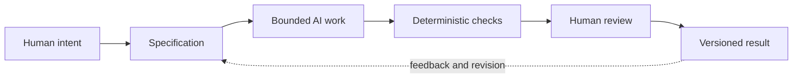

# Chapter 5: Persuasion, Meaning, and Machines

The first four chapters looked at communication from different angles. Persuasion asks how a message can enable a response. Brand archetypes ask what identity or meaning a product expresses. Visual language asks how that meaning should look and feel. Together, these lenses form a practical framework for directing creative work, including work made with AI.

The framework is useful because AI can produce fluent material before anyone has decided what the material is supposed to accomplish. A polished answer is not automatically a good answer. Before generating, we need a purpose, a meaning, and a form that fit together.

## Three Questions Before the Prompt

### Persuasion: What response are we trying to enable?

Persuasion identifies the response a person might reasonably take. The response could be noticing a product, understanding an explanation, comparing options, trying a process, or deciding to continue. This is not the same as forcing an outcome. Ethical persuasion gives people relevant reasons and leaves room to question, decline, or choose differently.

For an AI task, this question turns a vague request such as "make it compelling" into something more useful: "help a first-year student compare four product presentations and notice their ethical tradeoffs."

### Archetype: What meaning or identity are we expressing?

An archetype gives the work a recognizable role. Is the product acting like an Explorer's companion, a Sage's explanation, a Creator's blank canvas, or a Caregiver's support? The archetype should describe a meaning the work can credibly deliver, not a stereotype imposed on the audience.

For an AI task, this question helps choose the emotional and narrative center. It keeps several possible tones from competing at once and asks what the audience gets to feel, imagine, or become.

### Design language: How should that meaning look and feel?

Design language turns meaning into visible and sensory choices: hierarchy, type, spacing, imagery, color, rhythm, material, and structure. A restrained grid can make information feel controlled and inspectable. A disrupted collage can make an audience question familiar categories. The form should support the purpose rather than merely decorate it.

For an AI task, this question makes style actionable. Instead of asking for something "modern," specify the qualities that matter: a clear grid, generous spacing, restrained color, documentary images, or deliberately interrupted typography.

## A High-Level Control Framework

The three lenses can be used together as a short design brief:

| Lens | Controlling question | Example for the white T-shirt |
| --- | --- | --- |
| Persuasion | What response are we trying to enable? | Help the shopper compare fit and decide whether the shirt suits their needs |
| Archetype | What meaning or identity are we expressing? | A dependable Explorer companion or a disciplined Ruler standard |
| Design language | How should that meaning look and feel? | Field-note photography and practical captions, or a precise Swiss-influenced grid |

Changing one answer can change the whole presentation. A Rebel campaign should not use the same voice and composition as a Ruler product specification simply because both sell the same shirt. The object remains important, but the intended response, meaning, and form organize attention around different possibilities.

## Why AI Work Needs a Specification

AI is good at continuing patterns, combining instructions, and producing many options quickly. It is less reliable when the task's boundaries exist only in the requester's head. A specification makes the work bounded and reviewable.

A useful specification states:

- the output files or surfaces that may change;
- the audience and purpose;
- the required content or behavior;
- constraints such as tone, format, sources, or ethical limits;
- a small set of acceptance checks; and
- what is explicitly outside the task.

The specification does not need to predict every sentence the AI will write. It defines the space in which variation is welcome. For example, the white T-shirt case study can allow imaginative headlines while requiring four distinct concepts, a synthesis table, a valid Mermaid diagram, and no fabricated citations.

Without boundaries, generation can expand into redesign, unsupported claims, or attractive material that does not answer the assignment. A specification gives both the human and the AI something concrete to return to when the work starts to drift.

## Why Git Matters

Git provides traceability and recovery. A commit records a meaningful state of the work, while a branch can isolate one bounded task from the rest of the project. A diff shows what changed, which makes review more precise than relying on memory.

This matters especially when AI is involved because generation can be fast and extensive. If an edit introduces an error, version control makes it possible to identify the change, compare earlier states, and recover without losing the entire project. A useful history can answer:

- What did we ask for?
- What changed in this task?
- Which version was reviewed?
- When did a problem appear?
- Which earlier version can we restore or compare?

Git is not a substitute for judgment. It preserves decisions and makes them inspectable; it does not decide whether those decisions were wise.

## Deterministic Checks: Cheap and Repeatable

Some questions have clear answers that a tool can check the same way every time. These are **deterministic checks**. A script can verify that a required file exists, a heading appears, a link target is present, a code fence is closed, or a test returns the expected result.

These checks are valuable because they are fast, cheap, and repeatable. They catch omissions that are easy for a tired human to miss, and they can run after every edit or commit. They are especially useful for the mechanical part of acceptance criteria.

They also have limits. A check that confirms a heading exists cannot tell us whether the explanation is thoughtful. A passing link check cannot tell us whether the linked chapter is useful. Deterministic validation answers the questions it was designed to answer, not every question that matters.

## AI Review Is Useful but Probabilistic

An AI reviewer can help find unclear writing, repeated ideas, missing edge cases, inconsistent tone, or possible accessibility problems. It can offer a second reading at a useful speed. That makes it a valuable assistant for review.

But AI review is probabilistic. It may miss a real error, flag a harmless choice, misunderstand context, or sound confident while making an unsupported claim. Its output is evidence to consider, not a final verdict. Important findings should be checked against the specification, the source material, the running system, or the actual audience.

The strongest workflow combines different kinds of checking: deterministic tools for repeatable structure, AI assistance for pattern-based interpretation, and human review for meaning and responsibility.

## Human Responsibility at the Pit Stop

Think of a fast-moving project as a race car during a long event. Automation can keep running around the track: generating drafts, formatting files, running tests, checking links, and reporting patterns. That speed is useful, but the car still needs pit stops.

At selected moments, people should slow down and inspect the important parts deliberately. Is the work pursuing the intended goal? Are the claims true? Does the tone respect the audience? Does the design carry the intended meaning? Are there cultural, legal, accessibility, privacy, or safety concerns? Is this actually ready to share?

Human review should be selective rather than ceremonial. A person does not need to reread every unchanged line after every automated check, but high-impact decisions deserve focused attention. Automation keeps the process moving; the pit stop makes sure the project is still heading somewhere worth going.

Humans remain responsible for:

- **judgment:** deciding what is good enough and what needs revision;
- **meaning:** deciding what the work communicates and whether that meaning is appropriate;
- **truthfulness:** checking facts, evidence, uncertainty, and claims;
- **context:** understanding the audience, culture, situation, and consequences; and
- **final decisions:** approving, rejecting, publishing, or revising the result.

## The Complete Workflow

The workflow below puts the ideas in order. It is a loop in practice: human review may lead to a revised specification, another bounded task, or a new check.

The arrow from the versioned result back to the specification is intentionally shown as feedback. Version control preserves the result, while review can reveal that the original boundary or acceptance check needs to improve.

## A Practical Preflight

Before asking AI to create or change something, write down:

1. **Intent:** What response should the work enable?
2. **Meaning:** What identity, value, or story should it express?
3. **Form:** What design language should make that meaning visible?
4. **Boundary:** Which files, features, or sections are in scope?
5. **Evidence:** Which claims or sources must be verified?
6. **Checks:** What can be tested automatically?
7. **Review point:** Which decisions require a human inspection before release?

After generation, compare the result to the preflight list. Treat anything outside the boundary as a question, not as an automatic improvement. The best AI-assisted work is not the work with the most output. It is the work whose purpose, meaning, form, and evidence remain connected.

## Questions for Next Week

- Where could a specification make one of my future AI tasks more focused?
- Which parts of my work can be checked deterministically, and which require interpretation?
- What is one claim an AI system might produce that I would need to verify myself?
- What meaning does my project express, intentionally or unintentionally?
- Which audience or context might interpret that meaning differently than I expect?
- Where is the right pit-stop moment for human review?
- What would I want Git history to help me understand if the result went wrong?

## What You Should Remember

Persuasion asks what response a message should enable. Archetype asks what meaning or identity it expresses. Design language asks how that meaning should look and feel. Together, these lenses turn vague creative direction into a usable control framework.

AI can generate and inspect work quickly, but it works best inside a clear specification. Git provides traceability and recovery. Deterministic checks catch repeatable structural problems. AI review can reveal patterns but remains probabilistic. Humans are still responsible for judgment, meaning, truthfulness, context, and final decisions. Keep the automation running, choose the important pit stops, and inspect the work that matters.